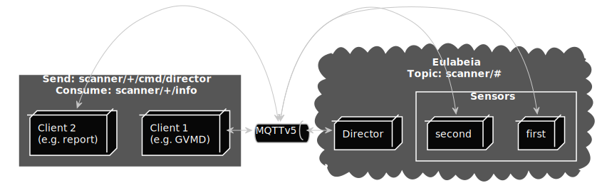

# eulabeia

Eulabeia is a management layer with the task to control a multiple scanner on multiple machines environment easily and more predictable. Therefore it introduces a small set of commands. The orchestration is based on a single director entity and a MQTT broker is responsible for transmission of data and commands.

Eulabeia comes with four [roles](docs/roles/roles-and-relationship.md), two of which are direct eulabeia entities:

- a director - manages multiple sensors and is the main communication partner of a client
- sensor(s) - manages (or is) a scanner (currently [openvas](https://github.com/greenbone/openvas-scanner) and in future also [notus](https://github.com/greenbone/notus-scanner) and more)
- scanner(s) - a program to scan for vulnerabilities
- client - is the using party of eulabeia (currently [gvmd](https://github.com/greenbone/gvmd))

The communication between each entity is done via [normalized messages](docs/messaging.md) over a MQTTv5.

For a detailed overview about eulabeia please checkout the [documentation](docs/README.md).



## Included projects

- director, the director implementation
- sensor, the sensor implementation for [openvas-scanner](https://github.com/greenbone/openvas-scanner/)
- libeulabeia, the c library to use eulabeia

## Requirements

The minimal requirements to use eulabeia are:
- go
- docker
- make

If you want to build and run eulabeia without container you need:

- a mqtt broker (e.g. mosquitto)
- openvas-scanner (currently middleware branch)
- redis

If you want to build `libeulabeia` you need:

- [gvm-libs](https://github.com/greenbone/gvm-libs)
- [libpaho](https://www.eclipse.org/paho/files/mqttdoc/MQTTClient/html/index.html)
- [cgreen](https://cgreen-devs.github.io/)
installed and configured.

## Installation

If you just want to test eulabeia without installing it on your machine you should use the provided docker images by running `make start-smoke-test` .

Please follow the [requirements](docs/requirements.md) instruction before installing eulabeia.

When all requirements are met you can build the sensor and director binaries by executing:

```
make build
```

This will create the binaries:
- `bin/eulabeia-director`
- `bin/eulabeia-sensor`
- `bin/example-client`

Before you can use the director or sensor you need to [configure it based on your MQTT address and redis socket](docs/requirements.md#director-1).

The next step is to start the director (`./bin/eulabeia-director`) and sensor (`./bin/eulabeia-sensor`).

To validate the correctness of the setup you can execute the example client: `./bin/example-client`.

For a more detailed explanation about the requirements please refer to [requirements.md](docs/requirements.md).

## Usage

Since eulabeia is not indented to be used as a program but is a rather a service environment and meant to be used via a library or specified workflows by another service / program please refer to:

- [docs](./docs/README.md)
- [docs/messaging](./docs/messaging.md)
- [docs/examples](./docs/message_examples.md)
- [docs/error](./docs/error-handling.md)
- [docs/start-scan](./docs/sequences/start_scan.md)

## Support

For any question on the usage of Eulabeia please use the
[Greenbone Community Portal]. If you found a problem with the software, please
create an issue on GitHub. If you are a Greenbone customer you may alternatively
or additionally forward your issue to the Greenbone Support Portal.

## Maintainer

This project is maintained by [Greenbone Networks GmbH][Greenbone Networks]

## Contributing

Your contributions are highly appreciated. Please
[create a pull request](https://github.com/greenbone/eulabeia/pulls)
on GitHub. Bigger changes need to be discussed with the development team via the
[issues section at GitHub](https://github.com/greenbone/eulabeia/issues)
first.

## License

Copyright (C)2021 [Greenbone Networks GmbH][Greenbone Networks]

Licensed under the [GNU Affero General Public License v3.0 or later](LICENSE).

[Greenbone Networks]: https://www.greenbone.net/
[Greenbone Community Portal]: https://community.greenbone.net/

<!---
After making yourself familiar with

- [coding-style](./docs/coding-style.md)
- [testing](./docs/testing.md)
- [commit-structure](./docs/commits.md)

please create a pull request.
--->
