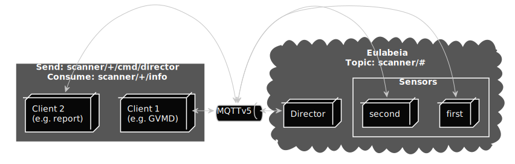

# Roles and Relationship

Within eulabeia we have four different roles.

Although one system can have multiple roles (e.g. a sensor can be a scanner) we differentiate based on:

- [director](#director)
- [sensor](#sensor)
- [scanner](#scanner)
- [client](#client)

There can be multiple clients, sensor and scanner within the eulabeia concept but just one director.

The client should just communicate with the director, the director communicates with sensor, sensor with scanner and scanner with director or scanner depending on the implementation and context.

This means that the communication between an external client and director is strict while the internal communication is less so.

This allows us to make internal changes (behind director) without having to change the logic a client communicates with eulabeia, too. Another reason is that this also allows us to introduce supportive scanners without the client knowing about these and thus allows extending results in a transparent fashion.

To make the communication more transparent for either audits, special cases (like a indirect scanner) each message is send via a broker based on MQTTv5.

In theory a client can directly send cmds to a specific sensor it is not supported and on its own risk.
<!---
render with: plantuml -tsvg roles-and-relationship.md
@startuml relationship
skinparam monochrome reverse
skinparam cloud {
    BackgroundColor darkgrey
}
skinparam rectangle {
    BackgroundColor darkgrey
}
rectangle "Send: scanner/+/cmd/director\nConsume: scanner/+/info" as c{
    node "Client 1 \n (e.g. GVMD)" as c1
    node "Client 2 \n (e.g. report)" as c2
}
    queue "MQTTv5" as q1 
cloud "Eulabeia\nTopic: scanner/#" as e {
    node "Director" as d
    rectangle "Sensors" as s {
        node "first" as s1
        node "second" as s2
    }
}
c1 <-> q1
c2 <-> q1
q1 <-> d
q1 <-> s1
q1 <-> s2
@enduml
-->

## director

The main responsibility of a director is to delegate requests from a client to a corresponding sensor or serve data when available.

A director is subscribed to:

- `scanner/cmd/scan/director`, see [scan](../message_example#scan)
- `scanner/cmd/target/director`, see [target](../message_example#target)
- `scanner/cmd/sensor/director`, see [sensor](../message_example#sensor)
- `scanner/cmd/vt/director`, see [vt](../message_example#vt)

## sensor

The main responsibility of a sensor is to to handle `start` events and control that the actual scan is executed.

## scanner

A scanner is either also a sensor or is controlled by a dedicated sensor.

- [OpenVAS](https://github.com/greenbone/openvas-scanner/) is an active scanner and handled via the sensor within this repository.
- [Notus](https://github.com/greenbone/notus-scanner/) is a supportive scanner and triggered transparently in the background.
