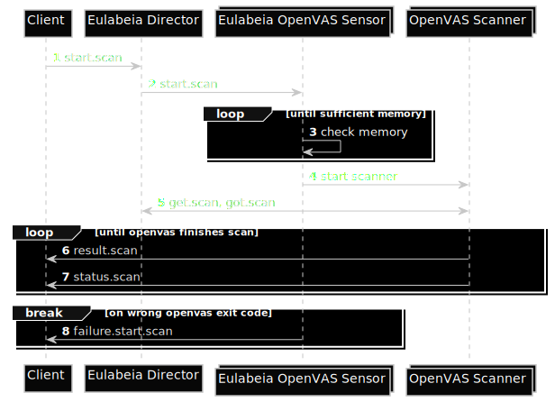

# Start Scan

Before a scan can be started it should be created, this has the advantage that this scan can be executed as previously defined without having to resend it.

Although it is possible to create a temporary scan, that will be automatically deleted, when finished, it should not be seen as the default case.

The flow is:
1. The client creates a target (either via `create` or directly via `modify` when it has directly all the data at hand)
1. The client creates a scan with the `target_id`
1. The client sends `start.scan` with the `scan_id`
1. The director informs the corresponding sensor
1. That sensor verifys that it can start the scan
1. The sensor starts the actual scan
1. While scanning `result.scan` and `status.scan` are send back to the client
  a. The sensor may inform the client about failures

Currently we only support [OpenVAS](https://github.com/greenbone/openvas-scanner/) which is not implemented as a daemon and therefore we introduced the differentiation between sensor and scanner. This may not be the case on other scanners introduced in the future.

The difference between target and scan is that target contains of information which usually won't change that often and if changed it can affect different scan.

Although the scan contains the target data directly they are separated implementation wise.

## Create a scan
<!---
render with: plantuml -tsvg start_scan_sequence.md
@startuml create_scan
skinparam monochrome reverse
autonumber
participant Client
participant "Eulabeia Director" as director
Client <-> director : [[https://github.com/greenbone/eulabeia/blob/main/docs/message_examples.md#createtarget create.target]], [[https://github.com/greenbone/eulabeia/blob/main/docs/message_examples.md#createdtarget created.target]]
Client <-> director : [[https://github.com/greenbone/eulabeia/blob/main/docs/message_examples.md#modifytarget modify.target]], [[https://github.com/greenbone/eulabeia/blob/main/docs/message_examples.md#modifiedtarget modified.target]]
Client <-> director : [[https://github.com/greenbone/eulabeia/blob/main/docs/message_examples.md#modifyscan modify.scan]], [[https://github.com/greenbone/eulabeia/blob/main/docs/message_examples.md#modifiedscan modified.scan]]
@enduml

--->

### Messages

- [create.target](../message_examples.md#createtarget)
- [created.target](../message_examples.md#createdtarget)
- [modify.target](../message_examples.md#modifytarget)
- [modified.target](../message_examples.md#modifiedtarget)
- [modify.scan](../message_examples.md#modifyscan)
- [modified.scan](../message_examples.md#modifiedscan)

## Start a scan
<!---
render with: plantuml -tsvg start_scan_sequence.md
@startuml start_scan
skinparam monochrome reverse
autonumber
participant Client
participant "Eulabeia Director" as director
collections "Eulabeia OpenVAS Sensor" as sensor
collections "OpenVAS Scanner" as openvas
Client -> director : [[https://github.com/greenbone/eulabeia/blob/main/docs/message_examples.md#startscan start.scan]]
director -> sensor : [[https://github.com/greenbone/eulabeia/blob/main/docs/message_examples.md#startscan start.scan]]
loop until sufficient memory
    sensor -> sensor : check memory
end
sensor -> openvas: start scanner
openvas <-> director : [[https://github.com/greenbone/eulabeia/blob/main/docs/message_examples.md#getscan get.scan]], [[https://github.com/greenbone/eulabeia/blob/main/docs/message_examples.md#gotscan got.scan]]
loop until openvas finishes scan
    openvas -> Client : [[https://github.com/greenbone/eulabeia/blob/main/docs/message_examples.md#resultscan result.scan]]
    openvas -> Client : [[https://github.com/greenbone/eulabeia/blob/main/docs/message_examples.md#statusscan status.scan]]
end
break on wrong openvas exit code
    sensor -> Client : [[https://github.com/greenbone/eulabeia/blob/main/docs/message_examples.md#failurestartscan failure.start.scan]]
end
@enduml

--->

### Messages

- [start.scan](../message_examples.md#startscan)
- [get.scan](../message_examples.md#getscan)
- [got.scan](../message_examples.md#gotscan)
- [result.scan](../message_examples.md#resultscan)
- [status.scan](../message_examples.md#statusscan)
- [failure.start.scan](../message_examples.md#failurestartscan)
