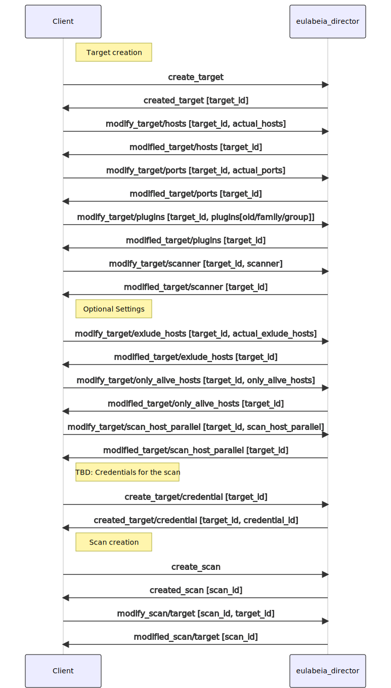

# Start Scan

To start a scan a scanner must know:
- the hosts (must have)
- the port range (must have)
- the plugins to execute (must have [on openvas])
- if it should test alive hosts only (default: true)
- if it should scan various hosts in parallel (default: false)
- reverse lookup (default: false)
- excluded hosts (default: empty)

with the limitation that a scan shall only start when sufficient memory is available.

Therefore we the necessary data within the scan context must be created before a scan starts.

The actual data is usually accumilated via a UI by a client of `eulabeia` and will be stored as a `target`.

After that a `scan` must be created; each `scan` must have a `target`. 

Based on the target information `director` is choosing the `sensor` on `start_scan`.

## Create Scan

## Execute Scan

